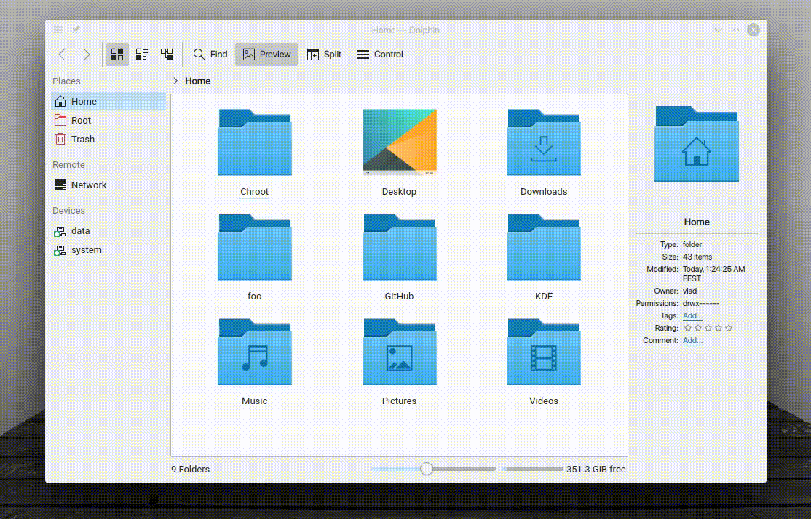

"Disappear 1" is a KWin effect that animates the disappearing of windows.

## Installing

### Arch Linux

For Arch Linux [kwin-effects-disappear1](https://aur.archlinux.org/packages/kwin-effects-disappear1/)
is available in the AUR.

### From source

```sh
git clone https://github.com/zzag/kwin-effects-disappear1.git
cd kwin-effects-disappear1
mkdir build && cd build
cmake ..
make -jN
sudo make install
```
